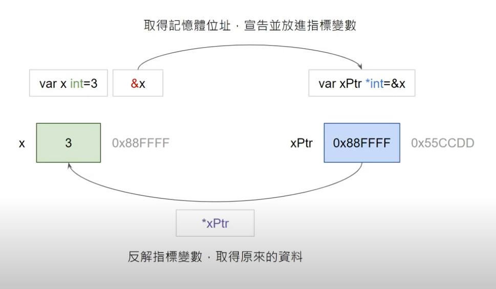
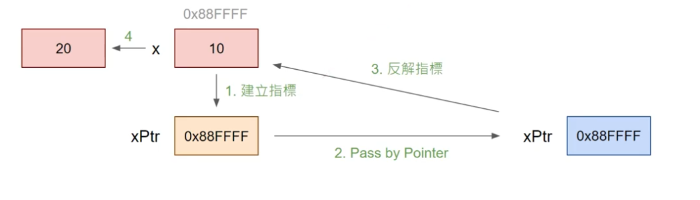

# Golang
---
### 執行流程 ([hello.go](./src/hello.go))
1. 撰寫程式

<pre><code>    package main <font color="green">/// 可執行程式必須使用名稱為 main 的封包</font>
    import "fmt" <font color="green">/// 載入內建的 fmt 封包，用作基本輸出輸入</font>
    func main(){      <font color="green">// 程式入口函式</font>
        fmt.Println("Hello Golang")
    } </code></pre>

2. 建置(build)
    - 開啟終端機
    - 輸入指令：
    ```
    $ go build {程式名稱}
    $ go build hello.go
    ```
    - 將產生一個執行檔 {程式名稱} 檔案
3. 執行程式
    ```
    $ ./{程式名稱}
    $ ./hello
    ```
---
### 資料型態 ([data-var.go](./src/data-var.go))
- int 整數
- float64 浮點數
- string 字串
- bool 布林值
- rune 字元
- [struct](#struct) 結構
- [array](#array) 陣列
---
### 變數 ([data-var.go](./src/data-var.go))
- 宣告變數
    - var {變數名稱} {資料型態}
        - var x int
- 指定變數
    - var {變數名稱} {資料型態} = {對應的型態的資料}
        - var x int = 9
    - {變數名稱} = {對應的型態的資料}
        - x = 9
---
### 載入內建封包

<pre><code>import "{封包名稱}"</code></pre>
---

### 基本輸入輸出 (basic-i)

前置：需載入內建輸入輸出用封包(fmt)
#### 終端介面輸入
`fmt.Scanln(&{變數名稱}, &{變數名稱})`
#### 終端介面輸出
<pre><code>fmt.Println({變數名稱}, {變數名稱}) <font color="green">// 會換行</font></pre></code>
<pre><code>fmt.Print({變數名稱}, {變數名稱}) <font color="green">// 不會換行</font></pre></code>
---

### 運算符號 ([op.go](./src/op.go))
- 算術運算 - +, -, *, /
- 指定運算 - =, :=, +=, -=, *=, /=
    - <font color=red>:=</font> , 為自動宣告、判斷型態並指定值
    - x := 5, 指派５給 x
- 單元運算 - ++, --
- 比較運算 - >, <, >=, <=, ==
- 邏輯運算 - !, &&, ||
---

### 判斷式 ([flow-if.go](./src/flow-if.go))
- if
<pre><code>if {布林值}{
    <font color="green">// 布林值為 true 執行此處程式</font>
} else if {布林值2} {
    <font color="green">// 布林值2為 true 執行此處程式</font>
} else {
    <font color="green">// 布林值2為 false 執行此處程式</font>
}</code></pre>
---

### 迴圈 ([flow-for.go](./src/flow-for.go))
只有一種回圈。
- for
<pre><code>for {布林值} {
    <font color="green">// 若布林值為 true，執行此處程式</font>
}</code></pre>

<pre><code>for {初始化};{布林值};{變數增減} {
    <font color="green">// 若布林值為 true，執行此處程式</font>
    <font color="green">// 執行完後重新判斷 {布林值}，判斷是否重頭再執行一次</font>
}</code></pre>

- 迴圈中的命令 ([flow-for-cmd.go](./src/flow-for-cmd.go))
    - break
    - continue
---

### 函式 ([func-basic.go](./src/func-basic.go))([func-return.go](./src/func-return.go))
格式：
<pre><code>func {函式名稱}({參數列表}) {要回傳的資料型態}{
    <font color="green">// 函式內部程式碼</font>
}</code></pre>
範例 (加法函示)：
<pre><code>func add(a float64, b float64) float64{
    return a+b
}</code></pre>
---

### 指標基礎 Pointer ([pointer.go](./src/pointer.go))([pointer-apply.go](./src/pointer-apply.go))

- 儲存記憶體的位址
- 有資料型態限制，整數指標變數只能儲存整數的變數記憶體位址。

<pre><code>var x int = 3
fmt.Println(<font color="red">&</font>x)
<font color="green">// 輸出：{記憶體位址}</font></code></pre>

<pre><code><font color="green">// 使用指標變數來存放 x 記憶體位址</font>
var x int = 3
<font color="green">// 指標變數的資料型態需有星星前綴(*)</font>
var xPtr <font color="red">*</font>int = &x
fmt.Println(<font color="red">xPtr</font>)
<font color="green">// 輸出：{記憶體位址}</font></code></pre>
- 反解指標變數，將印出變數的值。

<pre><code>var x int = 3
var xPtr *int = &x
<font color="green">// 反解指標變數需在變數前綴加星星(*)</font>
fmt.Println(<font color="red">*</font>xPtr)
<font color="green">// 輸出：3</font></code></pre>



- 應用：呼叫函式時，資料如何透過參數傳遞

<pre><code>func main(){
    var x int = 10
    add(&x) <font color="green">// Pass By Pointer</font>
    fmt.Println(x)
    <font color="green">// 將印出 20</font>
    var xPtr *int = &x
    add(xPtr) <font color="green">// Pass By Pointer</font>
    fmt.Println(x)
    <font color="green">// 將印出 30</font>
}

func add(xPtr *int){
    *xPtr += 10
    fmt.Println(*xPtr)
    <font color="green">// 將印出 20</font>
}</code></pre>



---

### <a id="struct" /> 結構 Struct ([struct.go](./src/struct.go))

存放其他資料的容器，也是一種資料型態。

- 定義語法

<pre><code>type {結構名稱} struct{
    {欄位名稱} {資料型態}
    {欄位名稱2} {資料型態2}
    ...
}</code></pre>

- 範例

<pre><code>type Point struct{
    x int
    y int
}</code></pre>

- 實體化結構，給定資料

<pre><code>{結構名稱}{{欄位名稱}:{欄位資料}, {欄位名稱}:{欄位資料}}
{結構名稱}{{欄位資料}, {欄位資料}}</code></pre>

- 範例

<pre><code>type Point struct{
    x int
    y int
}
func main(){
    var p1 Point = Point(3,4) <font color="green">// x 是 3, y 是 4</font>
    var p2 Point = Point(y:3, x:4) <font color="green">// x 是 4, y 是 3</font>
}</code></pre>

- 取的對應資料語法
```
{結構實體}.{欄位名稱}
```

- 範例

<pre><code>type Point struct{
    x int
    y int
}
func main(){
    var p1 Point = Point(3,4)
    var p2 Point = Point(y:3, x:4)
    fmt.Println(p1.x, p2.x) <font color="green">// 印出 p1 的 x，p2 的 x</font>
}</code></pre>


---

### <a id="array">陣列 Array [(array.go)](./array.go)

- 陣列資料型態
```
[{長度}]{資料型態}

[5]int
```
- 範例
<pre><code>var arr [4]int
fmt.Println(arr[2])
<font color="green">// 宣告附值方法</font>
var arr1 [4]int = [4]int{1, 3, 2, 4}
var arr2 [2]string = [2]string{"Hello", "Golang"}
var arr3 [3]bool = [3]bool{true, bool, arr[0]>1}
var arr4 [1]float64 = [1]float64{2.31}
arr1[0] = 100
arr1[1] = 5
arr1[2] = 3
arr1[3] = 90
</code></pre>

- 取得陣列長度函式 len()
<pre><code>var arr [4]int
fmt.Println(len(arr))
<font color="green">// 輸出４</font>
</code></pre>

- 用迴圈輪詢陣列每個值
<pre><code>var arr [4]int = [4]int{3, 10, -2, 0}
for i:=0; i<=len(arr); i++ {
    fmt.Println(arr[i])
}
<font color="green">// 輸出:</font>
<font color="green">// 3</font>
<font color="green">// 10</font>
<font color="green">// -2</font>
<font color="green">// 0</font>
</code></pre>